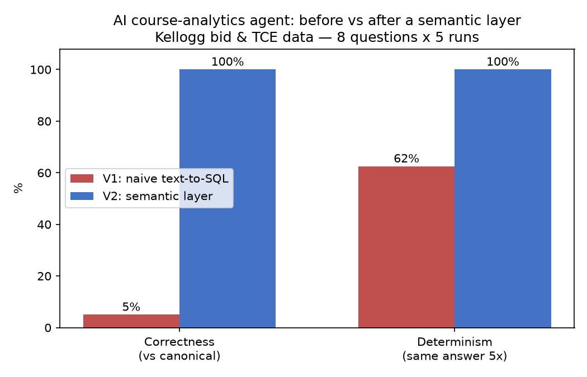
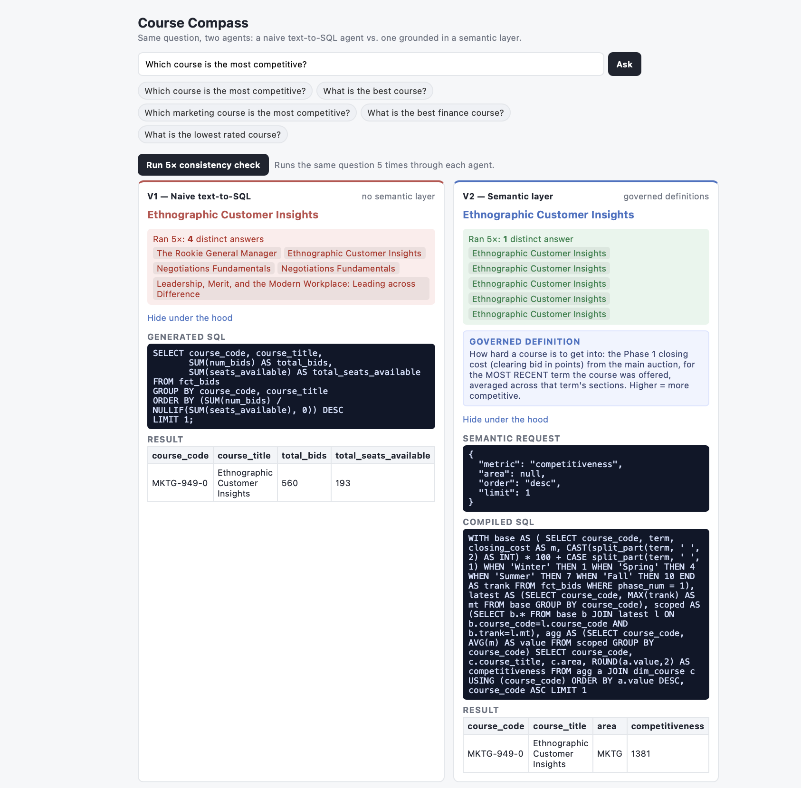

# Course Compass

*A semantic layer that makes an AI course-analytics agent give trustworthy, consistent answers.*

A small, end-to-end demonstration of **why a semantic layer makes AI-powered analytics
trustworthy** — built on real Kellogg course data (bidding points and teaching
evaluations).

The project asks a plain-English question ("Which course is the most competitive?",
"What's the best finance course?") two different ways and compares them:

- **V1 — naive text-to-SQL:** an LLM sees the raw database schema and writes SQL directly.
- **V2 — semantic layer:** the LLM only picks a *governed metric definition*; a semantic
  layer compiles that into the one canonical SQL query.

The result is the whole point of the project:



> On 8 questions run 5× each: **correctness 5% → 100%** and **determinism 62% → 100%**,
> using the *same LLM* and the *same data*. The only thing that changed is **where the
> business definition lives.**

---

## The problem this demonstrates

Ask a naive LLM agent "which course is the most competitive?" five times and you get
several different answers — because "competitive" isn't defined anywhere. The model
guesses a definition each time: sometimes total bids across all phases, sometimes peak
bids, sometimes a bids-per-seat ratio; some runs invent a formula outright. Every query
runs fine. They're just answering different questions.

This is not a model-quality problem. It's a **missing-semantics** problem: the business
definition of each metric lives in people's heads, not anywhere the agent can reliably
consume it. A semantic layer fixes it by defining each metric **once**, in a governed,
versioned, executable form that every consumer shares.

## What's built today (Phase 1 — complete)

A full pipeline you can run from the command line:

1. **Mock warehouse** — three raw CSVs (course schedule, bid stats, TCE ratings) loaded
   into a local **DuckDB** database (`scripts/01_load.py`).
2. **Clean data model** — typed fact/dimension tables (`dim_course`, `fct_bids`,
   `fct_tce`) with join keys. Deliberately *definition-free* — physical modeling is kept
   separate from business meaning (`scripts/02_model.py`).
3. **V1 naive agent** — LLM-generated SQL over the raw schema; captures inconsistent
   answers as the baseline (`scripts/03_v1_agent.py`).
4. **Semantic layer** — metric definitions in YAML (`semantic_layer/metrics.yml`) plus a
   compiler that turns a semantic request into canonical SQL (`scripts/semantic.py`).
5. **V2 semantic agent** — LLM maps the question to a governed metric; the layer owns the
   SQL, so answers are deterministic by construction (`scripts/05_v2_agent.py`).
6. **Evaluation + chart** — a golden set of questions graded for correctness and
   determinism, V1 vs V2, producing `reports/before_after.png` (`scripts/06_eval.py`).

### The two governed definitions (the "source of truth")

Encoded once in `semantic_layer/metrics.yml`:

- **Competitiveness** — Phase 1 closing cost (bid points) for the *most recent term*
  offered, averaged across sections.
- **Course rating** — response-weighted average of the overall (Global) TCE score for the
  *most recent term*, counting only sections with **≥ 10 responses** (to kill small-sample
  noise).

## The interactive web app (Phase 2 — built)

Ask your own questions in the browser and watch both agents answer side by side:



- **Backend:** FastAPI wrapping the engine (`/api/ask`, `/api/consistency`).
- **Frontend:** React (Vite) — one question box, two panels (V1 naive vs V2 semantic),
  each showing the answer, the generated SQL / semantic request, the results table, and
  (for V2) the governed definition it used.
- **Live consistency check:** a "Run 5×" button — V1 wobbles across several answers (red),
  V2 stays fixed at one (green). The determinism story, interactive.

## Repository structure

```
course-compass/
├── data/raw/            # your CSV exports (NOT committed — see Data below)
├── db/                  # generated DuckDB warehouse (NOT committed)
├── semantic_layer/
│   └── metrics.yml      # the governed metric definitions
├── scripts/
│   ├── 01_load.py       # CSV -> DuckDB
│   ├── 02_model.py      # clean fact/dim tables
│   ├── 03_v1_agent.py   # naive text-to-SQL agent
│   ├── semantic.py      # semantic-layer compiler
│   ├── 04_semantic_test.py
│   ├── 05_v2_agent.py   # semantic agent
│   └── 06_eval.py       # golden-set eval + chart
├── backend/             # FastAPI engine + API (engine.py, main.py)
├── frontend/            # React (Vite) app — side-by-side V1 vs V2 UI
├── reports/             # eval chart + results CSV
├── docs/                # screenshots
└── README.md
```

## Running it

Requires [uv](https://docs.astral.sh/uv/) and an [OpenRouter](https://openrouter.ai) API key.

```bash
# 1. install dependencies
uv sync

# 2. add your API key
echo "OPENROUTER_API_KEY=sk-or-your-key" > .env

# 3. put your three CSVs in data/raw/ (schedule.csv, bidstats.csv, tces.csv)

# 4. build the warehouse and run the pipeline
uv run scripts/01_load.py
uv run scripts/02_model.py
uv run scripts/04_semantic_test.py   # canonical answers (deterministic)
uv run scripts/03_v1_agent.py        # naive agent (inconsistent)
uv run scripts/05_v2_agent.py        # semantic agent (consistent)
uv run scripts/06_eval.py            # eval + before/after chart
```

### Run the web app

```bash
# terminal 1 — backend API
uv run uvicorn backend.main:app --reload --port 8000

# terminal 2 — frontend
cd frontend && npm install && npm run dev
```

Then open http://localhost:5173 and ask a question.

## Data

The raw Kellogg data (bid stats, teaching evaluations) is **not included** in this
repository. To run the pipeline, supply your own three CSV exports in `data/raw/`:

- `schedule.csv` — course schedule / offerings
- `bidstats.csv` — bidding stats per course, phase, and term
- `tces.csv` — teaching-evaluation scores per section

The scripts map the raw column names during load, so exact headers can vary.

## Why this exists

A hands-on study of a pattern that matters in enterprise analytics: as companies put
LLM agents in front of their data, the hard part isn't generating SQL — it's making the
answers *consistent and trustworthy*. That requires a governed semantic (metrics) layer
that defines what each business metric means, independent of both storage and the AI
consuming it. This project reproduces that failure and fix at small scale, on data
anyone at a business school can relate to.
